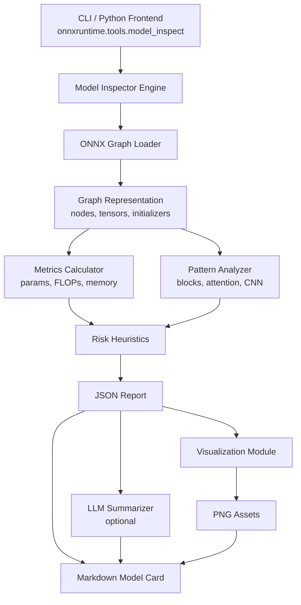

# ONNX Autodoc - Product Requirements Document

## Document Info

| Field | Value |
|-------|-------|
| Project | ONNX Autodoc / Model Architecture Inspector |
| Author | Marcus |
| Version | 1.0 |
| Last Updated | December 2, 2025 |
| Status | In Development |

**Related Documents:**
- [BACKLOG.md](BACKLOG.md) - Epic/Story/Task tracking
- [BRAINLIFT.md](BRAINLIFT.md) - Daily learning logs
- [Architecture.md](Architecture.md) - System design details
- [README.md](README.md) - Quick start guide

---

## Table of Contents

1. [Project Overview](#1-project-overview)
2. [Goals and Non-Goals](#2-goals-and-non-goals)
3. [Personas and User Stories](#3-personas-and-user-stories)
4. [Technical Architecture](#4-technical-architecture)
5. [CLI Design and JSON Schemas](#5-cli-design-and-json-schemas)
6. [Visualization Extension](#6-visualization-extension)
7. [Hardware Profiles and GPU Estimates](#7-hardware-profiles-and-gpu-estimates)
8. [Quantization Impact Panel](#8-quantization-impact-panel)
9. [External Pipeline Integration](#9-external-pipeline-integration)
10. [Testing Strategy](#10-testing-strategy)
11. [Dependencies](#11-dependencies)
12. [Error Handling](#12-error-handling)
13. [Implementation Timeline](#13-implementation-timeline)

---

## 1. Project Overview

### 1.1 One-Liner

**ONNX Autodoc** is a graph-level analysis and documentation tool for ONNX Runtime that inspects a model's architecture, computes static complexity metrics (FLOPs, params, activation memory), surfaces structural risk signals, and auto-generates human-readable reports and model cards that explain *how* the model works, not just how it performs on a test set.

### 1.2 Motivation

Modern ML teams increasingly inherit ONNX models they did not design:

- Vendor-supplied models shipped as `.onnx` artifacts
- Compressed / quantized models whose original training code is unknown
- Legacy models where only checkpoints remain

These models might perform well on benchmarks, but:

- Their internal architecture is opaque
- Potential failure modes are unclear
- Hardware suitability / deployment risk is uncertain

Existing ONNX Runtime tooling focuses on **performance** and **operator support** (e.g., perf tests, model usability checker for NNAPI/CoreML). This project adds a **model architecture inspector** that answers:

> *"What is this model structurally, how expensive is it, what are its likely failure modes, and how should we position it in our system?"*

### 1.3 Core Idea

Given a model `model.onnx`, ONNX Autodoc will:

1. Parse the graph (nodes, tensors, shapes, ops, attributes).
2. Compute structural metrics:
   - Parameter counts per node / block / whole model
   - FLOPs estimates and hot spots
   - Activation tensor sizes and peak memory
   - Attention-specific stats (num layers, heads, context, KV cache footprint) where applicable
3. Identify **risk signals** via heuristics, e.g.:
   - Extremely deep chains without skip connections
   - Non-standard residual patterns
   - Pathologically wide fully-connected layers
   - Mismatched input/output resolutions or shapes
   - Suspect dynamic shape usage for deployment
4. Emit a **structured JSON report** and optional **Markdown/HTML summary**.
5. (Optional) Use an external LLM to summarize findings into a model card.

This becomes a first-class **model inspection** tool in the ONNX Runtime ecosystem.

---

## 2. Goals and Non-Goals

### 2.1 Goals

1. **Graph-Level Architecture Analysis**
   - Robust parsing of ONNX graphs (nodes, edges, initializers, shapes).
   - Layer/block aggregation (e.g., grouping Conv->BN->Relu into a single logical block).

2. **Static Complexity Metrics**
   - Parameter count per node, per block, and globally.
   - FLOP estimates for common ops (Conv, Gemm, MatMul, Self-Attention, etc.).
   - Approximate peak activation memory.

3. **Risk/Smell Detection**
   - Rule-based heuristics to flag potentially problematic architectures.
   - Configurable thresholds for "warning" vs "info" (e.g., model too big for mobile, too deep for training stability, etc.).

4. **Human-Readable Autodoc Output**
   - JSON: full structured report.
   - Markdown: model card + architecture summary. (Designed to integrate nicely with your existing batch-eval outputs.)

5. **Integration with ONNX Runtime Tooling**
   - Exposed as a CLI tool similar to `check_onnx_model_mobile_usability`.
   - Can be invoked via `python -m onnxruntime.tools.model_inspect` or an installed CLI entrypoint `onnxrt-inspect`.

6. **Visualization Support**
   - Matplotlib-based visualizations for architecture analysis
   - Operator distribution histograms, layer depth profiles, parameter distribution charts
   - Embeddable in Markdown/HTML reports

### 2.2 Non-Goals (for MVP)

- Training / fine-tuning models.
- Dynamic runtime profiling or latency benchmarking (already covered by `onnxruntime_perf_test`).
- Auto-fixing models (MVP is read-only analysis; suggestions may be textual only).
- Exhaustive support for every exotic ONNX op (MVP focuses on common image/vision and transformer ops; others fall back to generic estimates).

---

## 3. Personas and User Stories

### 3.1 Personas

| Persona | Role | Primary Need |
|---------|------|--------------|
| **Nina** | ML Infra Engineer | Evaluate deployability of third-party ONNX models on specific hardware |
| **Dev** | Applied Scientist | Quick feedback on complexity and structural differences between architecture variants |
| **Sam** | MLOps/Platform Engineer | Automatic generation of architecture summaries and model cards for internal registry |

### 3.2 Key User Stories

| ID | As a... | I want to... | So that... |
|----|---------|--------------|------------|
| US-1 | ML infra engineer | Run a single command on an ONNX file and see parameter count, FLOPs, and peak memory | I can tell if it fits on our edge devices |
| US-2 | Applied scientist | Diff between two models' architecture reports | I can understand what structurally changed between v1 and v2 |
| US-3 | MLOps engineer | Get a machine-readable JSON report | I can ingest into my model registry for search and governance |
| US-4 | Tech lead | Get a human-readable model card | I can share it with cross-functional stakeholders |
| US-5 | VP Engineering | See visual summaries of model architecture | I can assess maintainability and deployment complexity |

---

## 4. Technical Architecture

### 4.1 Components

```
+-------------------+     +----------------------+     +------------------+
|  CLI / Python     | --> |  Model Inspector     | --> |  JSON Report     |
|  Frontend         |     |  Engine              |     +------------------+
+-------------------+     +----------------------+             |
                                   |                           v
                                   v                  +------------------+
                          +------------------+        |  Markdown/HTML   |
                          |  ONNX Graph      |        |  Model Card      |
                          |  Loader          |        +------------------+
                          +------------------+                 |
                                   |                           v
                                   v                  +------------------+
                          +------------------+        |  LLM Summarizer  |
                          |  Metrics         |        |  (Optional)      |
                          |  Calculator      |        +------------------+
                          +------------------+
                                   |
                                   v
                          +------------------+
                          |  Pattern         |
                          |  Analyzer        |
                          +------------------+
                                   |
                                   v
                          +------------------+
                          |  Risk            |
                          |  Heuristics      |
                          +------------------+
                                   |
                                   v
                          +------------------+
                          |  Visualization   |
                          |  Module          |
                          +------------------+
```

### 4.2 Component Descriptions

- **Graph Analysis Core (Engine)**
  - Implemented as a library module that:
    - Loads an ONNX model.
    - Traverses the graph (nodes, tensors, initializers).
    - Computes structural metrics and risk signals.

- **CLI / Python Frontend**
  - Thin wrapper calling the core engine.
  - Handles argument parsing, output formatting (JSON/Markdown), and optional LLM calls.

- **LLM Summarization (Optional)**
  - Separate module that:
    - Takes the JSON report as input.
    - Produces human-readable model descriptions and model card text.

- **Visualization Module**
  - Matplotlib-based chart generation
  - Produces PNG assets for embedding in reports

### 4.3 Placement in ONNX Runtime Repo

Target repo: `microsoft/onnxruntime` (forked).

**File Locations:**

| Component | Path |
|-----------|------|
| Python CLI & core logic | `onnxruntime/python/tools/model_inspect.py` |
| Compare CLI | `onnxruntime/python/tools/model_inspect_compare.py` |
| Analysis module | `onnxruntime/tools/autodoc/analysis.py` |
| Visualization module | `onnxruntime/tools/autodoc/visualizations.py` |
| Markdown renderer | `onnxruntime/tools/autodoc/render_markdown.py` |
| HTML renderer (optional) | `onnxruntime/tools/autodoc/render_html.py` |
| C++ core (stretch) | `onnxruntime/core/graph/model_inspector.h`, `.cc` |
| Python unit tests | `onnxruntime/test/python/tools/test_model_inspect.py` |
| C++ unit tests (stretch) | `onnxruntime/test/graph/model_inspector_test.cc` |
| Sample scripts | `samples/tools/model_inspect_*.sh` |

### 4.4 Mermaid Diagram



---

## 5. CLI Design and JSON Schemas

### 5.1 CLI Interface (MVP)

**Command:**

```bash
python -m onnxruntime.tools.model_inspect model.onnx \
  --out-json report.json \
  --out-md report.md \
  --llm-summary  # optional
```

**Required arguments:**
- `model_path`: path to `.onnx` model file.

**Optional flags:**

| Flag | Description |
|------|-------------|
| `--out-json PATH` | Write full JSON report to `PATH` (otherwise print to stdout) |
| `--out-md PATH` | Write Markdown summary/model card |
| `--max-layers N` | Truncate per-layer details to top N by FLOPs/params |
| `--llm-summary` | Call external LLM to generate natural-language summaries (reads API key from env) |
| `--log-level {debug,info}` | Logging verbosity |
| `--with-plots` | Generate visualization assets |
| `--assets-dir PATH` | Directory for plot PNGs |
| `--format {md,html}` | Output format for report |

### 5.2 JSON Report Schema (Draft)

```json
{
  "model": {
    "path": "string",
    "onnx_ir_version": "string",
    "opset_imports": [
      { "domain": "", "version": 17 }
    ],
    "producer_name": "string",
    "producer_version": "string",
    "domain": "string",
    "doc_string": "string"
  },
  "graph": {
    "name": "string",
    "num_nodes": 0,
    "num_edges": 0,
    "inputs": [
      {
        "name": "input",
        "elem_type": "float32",
        "shape": [1, 3, 224, 224]
      }
    ],
    "outputs": [
      {
        "name": "output",
        "elem_type": "float32",
        "shape": [1, 1000]
      }
    ]
  },
  "layers": [
    {
      "name": "conv1",
      "type": "Conv",
      "domain": "ai.onnx",
      "inputs": ["input"],
      "outputs": ["conv1_out"],
      "input_shape": [1, 3, 224, 224],
      "output_shape": [1, 64, 112, 112],
      "params": 9408,
      "flops": 118013952,
      "activation_bytes": 3211264,
      "group": "stem_block",
      "attributes": {
        "kernel_shape": [7, 7],
        "strides": [2, 2],
        "pads": [3, 3, 3, 3]
      }
    }
  ],
  "blocks": [
    {
      "name": "layer1_block0",
      "type": "ResidualBlock",
      "nodes": ["conv2", "bn2", "relu2"],
      "params": 102400,
      "flops": 450000000,
      "activation_bytes": 8388608
    }
  ],
  "metrics": {
    "total_params": 25557032,
    "total_flops": 4100000000,
    "peak_activation_bytes": 134217728,
    "attention": {
      "num_layers": 12,
      "num_heads": 12,
      "hidden_size": 768,
      "max_sequence_length": 2048,
      "kv_cache_bytes_per_token": 786432
    }
  },
  "risk_signals": [
    {
      "id": "large_dense_stack",
      "severity": "medium",
      "description": "Two consecutive fully-connected layers with width 4096 may be over-parameterized.",
      "nodes": ["fc1", "fc2"]
    },
    {
      "id": "no_skip_connections",
      "severity": "high",
      "description": "Very deep network (120 layers) with no residual or skip connections detected.",
      "nodes": []
    }
  ],
  "llm_summary": {
    "short": "string",
    "detailed": "string"
  }
}
```

This schema is intentionally verbose so you can:
- Ingest it into your **batch eval** pipeline.
- Join against performance metrics (F1, latency, etc.).
- Build dashboards that correlate *architecture* with *performance* and *deployment risk*.

---

## 6. Visualization Extension

### 6.1 Autodoc Flow With Visualizations

```
ONNX Model -> Analysis (ModelStats) -> Visualization Assets -> Markdown/HTML Report
```

**Pipeline Steps:**

1. **Load Model** - Load ONNX with `onnx.load`
2. **Analyze Model** - Operator distribution, parameter counts, layer depth estimates, shape snapshots
3. **Generate Visualizations** - Using matplotlib (`Agg` backend):
   - Operator type histogram
   - Layer depth profile
   - Parameter distribution
   - Shape evolution
   - Optional graph connectivity
4. **Render Report** - Markdown or HTML embeds visuals for leadership + technical details for ML engineers

### 6.2 The `ModelStats` Object

```python
from dataclasses import dataclass
from pathlib import Path
from typing import Dict, List, Tuple

@dataclass
class OpTypeStats:
    counts: Dict[str, int]
    params_per_op: Dict[str, int]


@dataclass
class LayerShapeSnapshot:
    layer_index: int
    node_names: List[str]
    shapes: List[Tuple[int, ...]]


@dataclass
class ModelStats:
    model_path: Path
    model_name: str
    num_parameters: int
    num_initializers: int
    num_nodes: int
    num_inputs: int
    num_outputs: int

    op_stats: OpTypeStats
    layer_shapes: List[LayerShapeSnapshot]
```

This object is the interface between analysis, plots, and rendering.

### 6.3 Visualization Module API

```python
try:
    import matplotlib
    matplotlib.use("Agg")
    import matplotlib.pyplot as plt
    _HAVE_MPL = True
except Exception:
    _HAVE_MPL = False

def generate_all_plots(stats: ModelStats, assets_dir: Path) -> Dict[str, str]:
    """Generate all visualization assets.

    Returns:
        Dict mapping plot name to file path, e.g.:
        {"op_type_hist": "assets/op_type_hist.png", ...}
    """
    pass
```

### 6.4 Visualization Types

| Chart | X-Axis | Y-Axis | Purpose |
|-------|--------|--------|---------|
| Operator Histogram | Op types (Conv, Relu, MatMul...) | Node counts | Identify architecture "style" |
| Layer Depth Profile | Layer index | Cumulative params/FLOPs | Show compute distribution |
| Parameter Distribution | Layer name | Param count | Find heavy layers |
| Shape Evolution | Layer index | Tensor dimensions | Track spatial resolution changes |

### 6.5 Markdown Embedding

```markdown
## Operator Type Distribution


### Executive Summary
- Model size: 123M parameters
- Dominant layers: Attention (72%)
- Architecture: Transformer encoder
```

### 6.6 Audience Framing

| Audience | Focus |
|----------|-------|
| **ML Engineers** | Identify compute/memory hotspots, validate graph assumptions, compare architectures |
| **VP Engineering / CTO** | Assess maintainability, estimate deployment complexity, inform optimization decisions |
| **C-suite / Board** | Understand cost drivers (inference, infra), see high-level architecture without jargon, support roadmap tradeoffs |

---

## 7. Hardware Profiles and GPU Estimates

### 7.1 Hardware Profiles

A hardware profile is a small JSON file describing a target device:

```json
{
  "name": "NVIDIA_RTX_4090",
  "vendor": "nvidia",
  "type": "gpu",
  "vram_bytes": 25769803776,
  "peak_fp16_flops": 330000000000000,
  "peak_fp32_flops": 82500000000000,
  "memory_bandwidth_bytes_per_s": 1000000000000
}
```

### 7.2 CLI with Hardware Profile

```bash
python -m onnxruntime.tools.model_inspect model.onnx \
  --hardware-profile profiles/rtx_4090.json \
  --batch-size 8 \
  --precision fp16
```

The inspector uses:
- Model FLOPs and activation bytes (from earlier analysis)
- Hardware peak FLOPs and memory bandwidth
- Requested `batch_size` and `precision`

To estimate:
- **VRAM required** (parameters + activations + simple workspace heuristic)
- **Theoretical latency bounds** (compute- vs bandwidth-limited)
- **Compute utilization estimate** at a given batch size
- Whether the model likely **fits in VRAM** for the given device

### 7.3 JSON Schema Extension - Hardware Estimates

```json
"hardware_estimates": {
  "device": "NVIDIA_RTX_4090",
  "precision": "fp16",
  "batch_size": 8,
  "vram_required_bytes": 1431655765,
  "fits_in_vram": true,
  "theoretical_latency_ms": 13.2,
  "compute_utilization_estimate": 0.72,
  "bottleneck": "memory_bandwidth"
}
```

This provides a static, explainable approximation of `nvidia-smi`-style metrics for a given model + hardware profile, without needing a live GPU.

### 7.4 Supported Hardware Profiles

| Profile | Focus |
|---------|-------|
| NVIDIA GPUs | Initial focus (RTX 4090, A10, T4, etc.) |
| AMD GPUs | Additional JSON profiles |
| Apple M-series | Additional JSON profiles |
| NPUs | Additional JSON profiles |

---

## 8. Quantization Impact Panel

### 8.1 Overview

Compare mode for multiple precision variants of the same model (e.g., fp32 / fp16 / int8).

### 8.2 Inputs

- Multiple ONNX model files for the same architecture:
  - `resnet_fp32.onnx`, `resnet_fp16.onnx`, `resnet_int8.onnx`
- Corresponding **eval/perf metrics JSON** files produced by a batch-eval or perf script

### 8.3 CLI - Compare Mode

```bash
python -m onnxruntime.tools.model_inspect_compare \
  --models resnet_fp32.onnx resnet_fp16.onnx resnet_int8.onnx \
  --eval-metrics eval_fp32.json eval_fp16.json eval_int8.json \
  --hardware-profile profiles/a10.json \
  --baseline-precision fp32 \
  --out-json quant_impact.json \
  --out-md quant_impact.md
```

The tool:
1. Runs (or loads) the core `model_inspect` report for each variant.
2. Loads eval/perf JSON for each variant.
3. Verifies models share the same architecture.
4. Produces a **single compare report** summarizing quantization trade-offs.

### 8.4 JSON Schema - Quantization Impact

```json
{
  "model_family_id": "resnet50_imagenet",
  "baseline_precision": "fp32",
  "variants": [
    {
      "precision": "fp32",
      "quantization_scheme": "none",
      "model_path": "resnet_fp32.onnx",
      "size_bytes": 102400000,
      "metrics": {
        "f1_macro": 0.931,
        "latency_ms_p50": 14.5,
        "throughput_qps": 680,
        "gpu_utilization_pct": 65,
        "vram_used_bytes": 4294967296
      },
      "hardware_estimates": {
        "device": "NVIDIA_A10",
        "batch_size": 8,
        "theoretical_latency_ms": 13.1,
        "compute_utilization_estimate": 0.62
      },
      "deltas_vs_baseline": null
    },
    {
      "precision": "fp16",
      "quantization_scheme": "fp16",
      "model_path": "resnet_fp16.onnx",
      "size_bytes": 51200000,
      "metrics": {
        "f1_macro": 0.929,
        "latency_ms_p50": 9.1,
        "throughput_qps": 1080,
        "gpu_utilization_pct": 79,
        "vram_used_bytes": 2818572288
      },
      "hardware_estimates": {
        "device": "NVIDIA_A10",
        "batch_size": 8,
        "theoretical_latency_ms": 8.7,
        "compute_utilization_estimate": 0.81
      },
      "deltas_vs_baseline": {
        "f1_macro": -0.002,
        "latency_ms_p50": -5.4,
        "throughput_qps": 400,
        "gpu_utilization_pct": 14,
        "vram_used_bytes": -1476395008
      }
    }
  ]
}
```

---

## 9. External Pipeline Integration

### 9.1 Design Philosophy

ONNX Autodoc is **evaluation-source agnostic**. It does not run benchmarks itself; instead, it consumes eval/perf metrics from external pipelines in a small, generic JSON format.

### 9.2 Generic Eval/Perf JSON Schema

External eval scripts (YOLO, ResNet, BERT, etc.) are expected to emit JSON of the form:

```json
{
  "model_id": "resnet50_fp16",
  "precision": "fp16",
  "task_type": "image_classification",
  "eval": {
    "primary_metric_name": "f1_macro",
    "primary_metric_value": 0.923,
    "metrics": {
      "f1_macro": 0.923,
      "precision_macro": 0.931,
      "recall_macro": 0.917,
      "mAP_50_95": 0.611
    }
  },
  "perf": {
    "latency_ms_p50": 8.2,
    "latency_ms_p95": 9.5,
    "throughput_qps": 1200,
    "gpu_utilization_pct": 78,
    "vram_used_bytes": 2852126720
  }
}
```

**Notes:**
- `task_type` is free-form (e.g., `object_detection`, `nlp`, `speech_recognition`)
- `eval.metrics` can contain any task-specific metrics
- `perf` fields are optional; if missing, Autodoc will still work with architecture + hardware estimates alone

### 9.3 Integration Points

This schema is intentionally minimal so it can be produced by:
- YOLO batch eval pipelines
- ONNX Runtime perf test wrappers
- Custom eval scripts in any language

---

## 10. Testing Strategy

### 10.1 Test Categories

| Category | Scope | Tools |
|----------|-------|-------|
| Unit Tests | Individual functions (param counting, FLOP estimation, risk detection) | pytest |
| Integration Tests | End-to-end CLI runs with real ONNX models | pytest + subprocess |
| Regression Tests | Output stability across code changes | snapshot testing |
| Visual Tests | Chart generation verification | matplotlib + image comparison |

### 10.2 Test Models

Use well-known ONNX models from the ONNX Model Zoo:

| Model | Type | Purpose |
|-------|------|---------|
| ResNet-50 | CNN | Basic conv/bn/relu patterns, residual blocks |
| BERT-base | Transformer | Attention patterns, large param counts |
| YOLOv8-n | Detection | Multi-scale features, complex outputs |
| MobileNetV2 | Mobile CNN | Depthwise separable convs, small model |

### 10.3 Test File Structure

```
onnxruntime/test/python/tools/
    test_model_inspect.py           # Unit tests for core analysis
    test_model_inspect_compare.py   # Unit tests for compare mode
    test_visualizations.py          # Chart generation tests
    test_cli.py                     # CLI integration tests
    fixtures/
        resnet50.onnx              # Test models (or download scripts)
        bert_tiny.onnx
```

### 10.4 Test Coverage Targets

| Component | Target Coverage |
|-----------|----------------|
| Param counting | 95% |
| FLOP estimation | 90% |
| Risk heuristics | 85% |
| CLI argument parsing | 100% |
| JSON schema compliance | 100% |

---

## 11. Dependencies

### 11.1 Required Dependencies

```txt
# Core dependencies (already in ONNX Runtime)
onnx>=1.14.0
numpy>=1.21.0

# Additional for model_inspect
protobuf>=3.20.0
```

### 11.2 Optional Dependencies

```txt
# For visualization
matplotlib>=3.5.0

# For LLM summarization
openai>=1.0.0  # or anthropic, etc.

# For HTML reports
jinja2>=3.0.0
```

### 11.3 Development Dependencies

```txt
pytest>=7.0.0
pytest-cov>=4.0.0
black>=23.0.0
ruff>=0.1.0
mypy>=1.0.0
```

### 11.4 Installation

```bash
# Minimal install (JSON/Markdown output only)
pip install onnxruntime

# With visualization support
pip install onnxruntime[autodoc-viz]

# With LLM summarization
pip install onnxruntime[autodoc-llm]

# Full install
pip install onnxruntime[autodoc-full]
```

---

## 12. Error Handling

### 12.1 Error Categories

| Category | Example | Handling |
|----------|---------|----------|
| **Input Errors** | Invalid ONNX file, missing file | Early exit with clear error message |
| **Analysis Errors** | Unsupported op, shape inference failure | Log warning, continue with fallback estimates |
| **Output Errors** | Can't write to path, permission denied | Raise with actionable message |
| **External Errors** | LLM API failure, network timeout | Graceful degradation (skip LLM summary) |

### 12.2 Error Codes

| Code | Meaning |
|------|---------|
| 0 | Success |
| 1 | Invalid input (file not found, invalid ONNX) |
| 2 | Analysis error (partial results available) |
| 3 | Output error (couldn't write files) |
| 4 | External service error (LLM, network) |

### 12.3 Logging Levels

| Level | Use Case |
|-------|----------|
| DEBUG | Detailed per-node analysis, shape inference steps |
| INFO | Progress updates, summary stats |
| WARNING | Unsupported ops, fallback estimates used |
| ERROR | Failures that prevent completion |

### 12.4 Graceful Degradation

The tool should always produce *some* output, even if partial:

- If shape inference fails for some nodes -> estimate params/FLOPs as 0, flag in warnings
- If matplotlib unavailable -> skip visualizations, produce JSON/Markdown only
- If LLM API fails -> skip LLM summary, produce rule-based summary only

---

## 13. Implementation Timeline

### Day 1 - Repo Exploration and Design

- Fork `microsoft/onnxruntime`
- Build ONNX Runtime locally; run core tests and existing tools (e.g., `check_onnx_model_mobile_usability`)
- Identify where graph structures are represented (C++ graph classes, Python ONNX loader)
- Finalize scope and choose MVP path:
  - Phase 1: Python-only using `onnx` library
  - Phase 2 (stretch): C++ engine with Python wrapper
- Draft detailed design doc in the repo

### Day 2 - Graph Parsing and Basic Metrics

- Implement core graph loader (MVP in Python):
  - Load ONNX model using `onnx`
  - Extract graph, nodes, initializers, shapes
- Implement param counting per node and globally
- Implement FLOPs estimation for key ops:
  - Conv, Gemm, MatMul, Add, Mul
- Write initial JSON emission code

### Day 3 - Advanced Metrics and Block Grouping

- Add block detection:
  - Group Conv+BN+Relu patterns into logical blocks
  - Identify transformer blocks (SelfAttention + MLP pattern) where possible
- Estimate activation sizes and peak memory by walking a topological order
- Add attention metrics for known patterns (BERT/ViT-like models)
- Extend JSON schema to include `blocks` and `metrics.attention`

### Day 4 - Risk Signals and CLI Integration

- Implement heuristic checks:
  - Excessive depth without skips
  - Oversized dense layers
  - Potentially problematic dynamic shapes for deployment
- Implement CLI entrypoint:
  - `python -m onnxruntime.tools.model_inspect`
- Validate CLI on a set of known models (ResNet, BERT, YOLO, etc.)

### Day 5 - Model Card Generation and LLM Summaries

- Implement Markdown model card generator:
  - High-level description
  - Key metrics table (params, FLOPs, memory, attention stats)
  - Risk signals table
- Implement optional LLM integration:
  - Reads API key from environment
  - Summarizes JSON report into short + long narrative
- Add toggles so users without LLM access can still use the tool fully

### Day 6 - Testing, Docs, and Examples

- Add unit tests for:
  - Param counting
  - FLOPs estimation
  - Activation size computation
  - Risk heuristics
- Add example scripts under `samples/`
- Write README for the tool

### Day 7 - Polish and Gauntlet Story

- Clean up code, add comments, and ensure style compliance
- Capture before/after samples for a couple of well-known models
- Prepare Gauntlet deliverables:
  - High-level writeup of how you navigated ONNX Runtime
  - Screenshots/snippets of JSON + Markdown outputs
  - Reflection on design choices and tradeoffs

---

## Appendix: Delta Log

*Use this section to track changes to the PRD over time.*

| Date | Section | Change | Reason |
|------|---------|--------|--------|
| Dec 2025 | Initial | Created unified PRD from starter pack + visualization extension | Consolidation |
| Dec 2025 | Structure | Split backlog into BACKLOG.md, brainlift into BRAINLIFT.md | Context window optimization |
| Dec 2, 2025 | 4.3 | Scaffolding complete: `tools/python/util/autodoc/` with analyzer, patterns, risks, report modules | Following ORT patterns from mobile_helpers |
| Dec 2, 2025 | Risk Signals | Added minimum thresholds for risk signals (1M+ params, 1B+ FLOPs) to avoid flagging trivial models | Common sense - don't recommend optimization for 13-param models |
| Dec 2, 2025 | README | Updated README.md to match actual implementation: correct paths, CLI flags, hardware profiles | Documentation accuracy |
| Dec 2, 2025 | Testing | Created comprehensive unit test suite: test_analyzer.py, test_patterns.py, test_risks.py, test_hardware.py, test_report.py | Code quality and regression prevention |
| Dec 2, 2025 | CI/CD | Added `.github/workflows/autodoc-ci.yml` with lint, type check, unit tests, and integration tests | Automated quality gates |
| Dec 2, 2025 | Visualization | Added `visualizations.py` with matplotlib Agg backend, dark theme, 4 chart types, CLI `--with-plots`/`--assets-dir`, Markdown embedding, 17 tests | Epic 5 complete |
| Dec 2, 2025 | Build | C++ ONNX Runtime build complete with CUDA provider (357MB); Python wheel build in progress | Environment setup milestone |
| Dec 2, 2025 | LLM | Added `llm_summarizer.py` with OpenAI integration, prompt templates, CLI `--llm-summary`/`--llm-model`, Executive Summary in Markdown | Epic 7 complete |
| Dec 2, 2025 | Hardware | Adding GPU Saturation metric (model_flops/gpu_capacity) alongside compute utilization | Better hardware insight |
| Dec 2, 2025 | PyTorch | Added PyTorch-to-ONNX conversion (--from-pytorch, --input-shape, --keep-onnx), Ultralytics metadata extraction, DatasetInfo in reports | Epic 4B implementation |
| Dec 2, 2025 | Attention FLOPs | Added _estimate_attention_flops() with full formula: 3*seq*d² + 2*heads*seq²*d_head + 5*heads*seq² + seq*d² | Task 2.3.3 complete |
| Dec 2, 2025 | KV Cache | Added KV cache estimation for transformers (kv_cache_bytes_per_token, kv_cache_bytes_full_context, kv_cache_config) | Task 2.4.3 complete |
| Dec 2, 2025 | Memory Breakdown | Added MemoryBreakdown dataclass with weights_by_op_type, activations_by_op_type, largest_weights/activations | Task 2.4.4 complete |
| Dec 2, 2025 | Progress | Added --progress CLI flag with step-by-step display for large model analysis | Task 4.1.3 complete |
| Dec 2, 2025 | Risk Thresholds | Added RiskThresholds dataclass for configurable severity thresholds | Task 3.2.5 complete |
| Dec 2, 2025 | HTML Parity | Identified gap: HTML missing Operator Distribution, KV Cache, Memory Breakdown, Architecture sections | Added Story 4.4 to backlog |
| Dec 2, 2025 | Non-standard Residuals | Added detect_nonstandard_residual_blocks() for Concat/Gated/Sub skip patterns, check_nonstandard_residuals() risk signal, Architecture sections in MD/HTML reports | Task 3.2.4 complete, Epic 3 complete |
| Dec 2, 2025 | HTML Parity | Added Operator Distribution table, KV Cache section, Memory Breakdown table to HTML report; CSS styling for .kv-cache, .memory-breakdown sections | Story 4.4 complete (4/4 tasks) |
| Dec 2, 2025 | JSON Schema | Added schema.py with Draft 7 JSON schema for InspectionReport, validate_report()/validate_report_strict() functions, report.validate() method, 12 new tests | Task 4.2.2 complete, Epic 4 complete |
